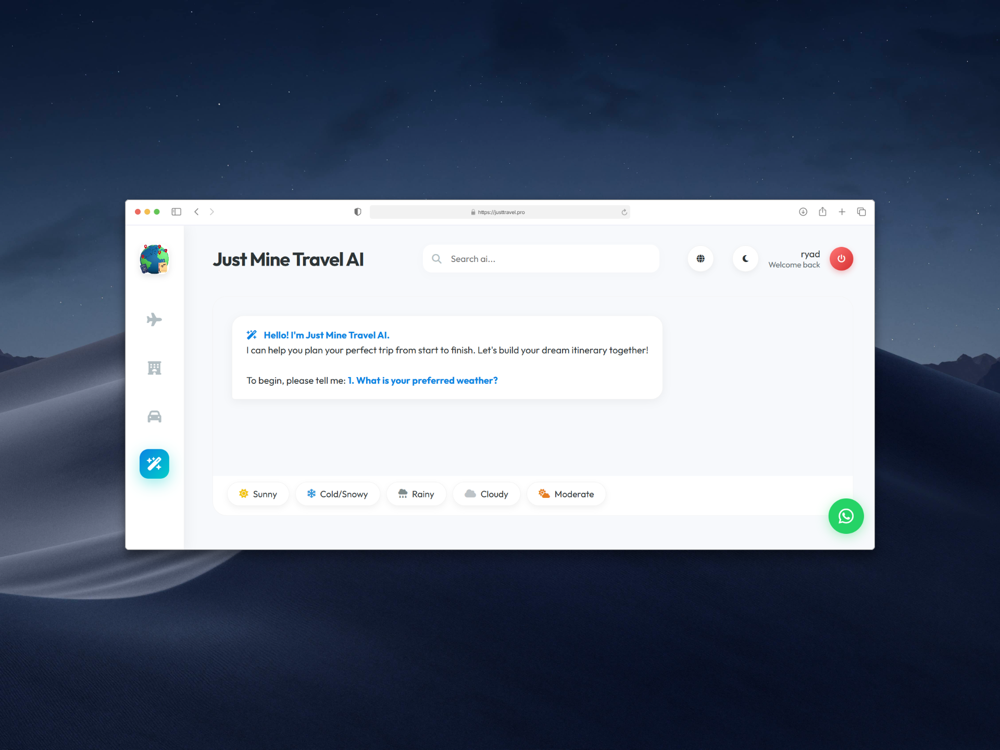
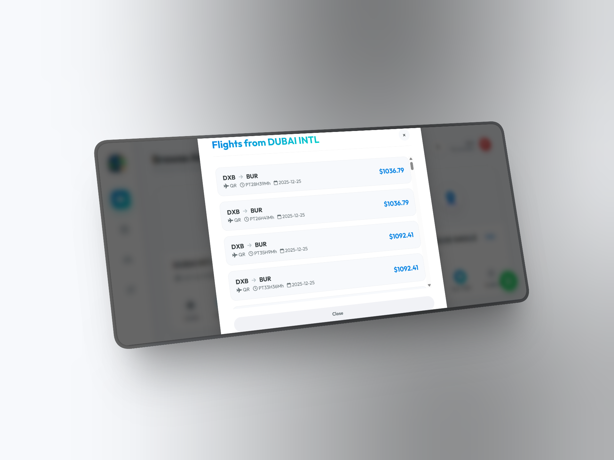
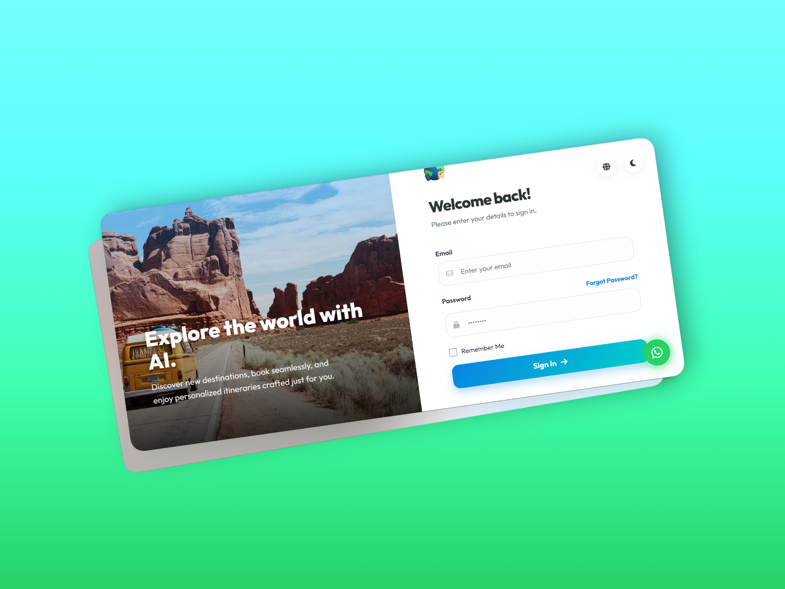
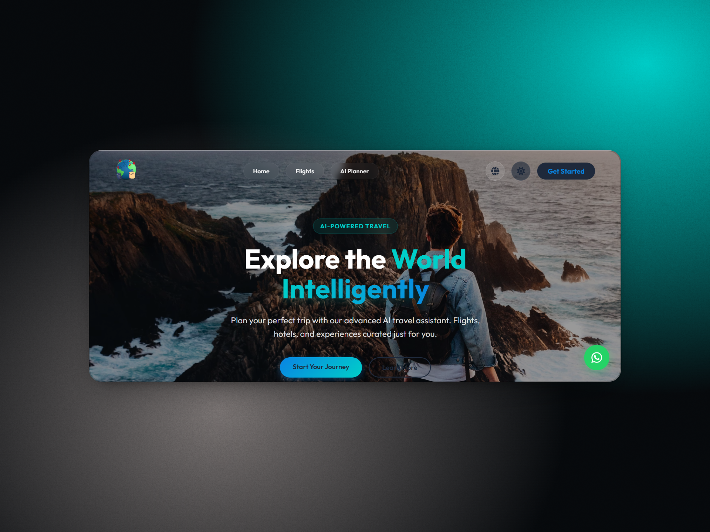

<div align="center">

# ✈️ Just Travel

### AI-Powered Travel Platform

**Plan smarter trips through conversation — flights, stays, and curated experiences in one AI-first travel platform.**

[](https://justtravel.pro)
[](https://laravel.com)
[](https://php.net)
[](https://justtravel.pro)

[**🌐 Live Demo**](https://justtravel.pro) · [**📧 Contact**](mailto:Info@thu-hunter.org) · [**💼 Portfolio**](https://portfolio.thu-hunter.org)

</div>

---

## 📋 Overview

**Just Travel** reimagines trip planning as a **dialogue instead of a form**. Instead of juggling multiple tabs for flights, hotels, and local tips, travelers interact with **JustMine** — an AI travel companion powered by Google Gemini — to shape their trip, then move seamlessly into search and booking flows backed by industry APIs.

> Built for travelers who want intelligence, speed, and a unified experience — not endless forms.

---

## ✨ Key Features

### 🤖 AI Travel Companion (JustMine)
- **Conversational trip planning** powered by Google Gemini
- Personalized itineraries based on user preferences
- Hidden gems & local recommendations
- Weather-aware suggestions
- Multi-turn conversations with context retention

### ✈️ Smart Flight Search
- Real-time flight data via **Amadeus APIs**
- Route comparison and price optimization
- Multi-city and round-trip support
- Integrated booking flow

### 🏨 Hotels & 🚗 Car Rentals
- Integrated catalog sync via **RapidAPI** (Zilyo / Hotels.com providers)
- Scheduled background updates for fresh inventory
- Detailed property views with photos and amenities
- Comparison tools across providers

### 🌍 Multilingual Experience
- **Arabic, English**, and additional locales
- Full RTL support for Arabic users
- Localized booking flows and content

### 📱 Mobile-First Design
- Responsive UI optimized for all devices
- Dark/light mode toggle
- Companion mobile app for on-the-go booking
- WhatsApp support integration

### ⚙️ Admin & Operations
- Laravel backend with **TCG Voyager** for content management
- Scheduled artisan jobs for API synchronization
- Production-ready deployment on Linux VPS

---

## 🛠️ Tech Stack

| Layer | Technology |
|-------|-----------|
| **Backend** | Laravel 10, PHP 8.1+ |
| **Database** | MySQL 8 |
| **Frontend** | Blade Templates, Vite, Modern CSS |
| **Authentication** | Laravel Sanctum |
| **AI Engine** | Google Gemini API |
| **Flight Data** | Amadeus API |
| **Hotels & Cars** | RapidAPI (Zilyo / Hotels.com) |
| **Admin Panel** | TCG Voyager |
| **Build Tools** | Vite, Laravel Mix |
| **Deployment** | Linux VPS, aaPanel, Nginx |
| **Background Jobs** | Laravel Scheduler, Artisan Commands |

---

## 🎯 Architecture Highlights

### Scheduled Inventory Sync

```
┌──────────────────────────────────────┐
│   Scheduled Artisan Sync Jobs        │
└──────────────────────────────────────┘
              │
              ├── Hotels Inventory (RapidAPI)
              ├── Car Rentals (RapidAPI)
              └── Cache Refresh & Index Updates
```

### Conversational AI Flow

```
User Message → Context Builder → Gemini API → Response Parser → 
  → Itinerary Generator OR Search Trigger → UI Render
```

### Booking Flow

```
Search Query → Amadeus/RapidAPI → Results → 
  → Filter/Sort → Selection → Booking → Confirmation
```

---

## 💡 What Makes It Different

Most travel platforms force users into rigid forms: dates, destinations, filters. **Just Travel flips the model**:

1. **Start with a conversation** — "I want a 5-day trip to Istanbul, budget-friendly, food-focused"
2. **AI builds the plan** — JustMine suggests itineraries, neighborhoods, hidden gems
3. **Search seamlessly** — Move from suggestion to live flight/hotel search with one tap
4. **Book in flow** — No tab-switching, no context-loss

---
---

## 📸 Screenshots

<div align="center">

<table>
  <tr>
    <td align="center">
      
    </td>
    <td align="center">
      
    </td>
  </tr>
  <tr>
    <td align="center">
      
    </td>
    <td align="center">
      
    </td>
  </tr>
</table>

*Live experience available at [justtravel.pro](https://justtravel.pro)*

</div>

---
## 🚀 Use Cases

- 🧳 **Solo travelers** seeking off-the-beaten-path experiences
- 👨‍👩‍👧 **Families** planning complex multi-stop trips
- 💼 **Business travelers** needing fast, integrated booking
- 🌏 **MENA region users** wanting Arabic-first travel tools

---

## 👨‍💻 My Role

**Full-Stack Development** — Built end-to-end:

- 🏗️ **Backend architecture** — Laravel models, services, and API layer
- 🤖 **AI integration** — Gemini conversation handling, prompt engineering, context management
- ✈️ **Booking flows** — Amadeus flight search and RapidAPI hotel/car integration
- 🔄 **Scheduled sync jobs** — Artisan commands for inventory updates
- 🌍 **Multilingual implementation** — i18n architecture for AR/EN locales
- 🚀 **Production deployment** — VPS setup, aaPanel configuration, Nginx tuning
- 📱 **Mobile-first UI** — Responsive Blade templates with modern CSS

---

## 📊 Production Stats

- **Live URL:** [justtravel.pro](https://justtravel.pro)
- **Status:** Active production
- **Stack health:** Monitored, optimized for conversion
- **Sync frequency:** Hourly catalog refresh

---

## 🔐 Code Access

This repository serves as a **public showcase** of the project. Core business logic, API credentials, and proprietary algorithms remain in the private working repository.

**For technical evaluation or partnership inquiries**, I'm happy to provide:
- Live walkthroughs of the codebase
- Architecture deep-dives
- Code samples under NDA
- Technical interview discussions

---

## 📬 Get In Touch

<div align="center">

| Channel | Contact |
|---------|---------|
| 📧 **Email** | [Info@thu-hunter.org](mailto:Info@thu-hunter.org) |
| 💼 **LinkedIn** | [linkedin.com/in/riad-al-sharabi](https://www.linkedin.com/in/riad-al-sharabi) |
| 🌐 **Portfolio** | [portfolio.thu-hunter.org](https://portfolio.thu-hunter.org) |
| 📱 **WhatsApp** | +963 99 2222 833 |

</div>

---

<div align="center">

**Built with focus, shipped with discipline.**

*Ryad El Sharabi · Full Stack Developer · SaaS & ERP Architect*

⭐ If you find this project interesting, consider starring the repo!

</div>
